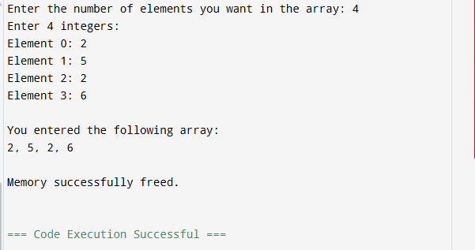
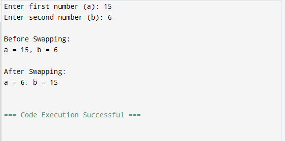
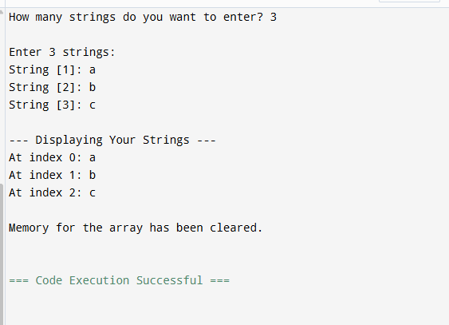
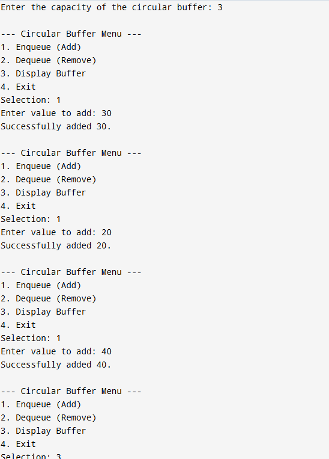
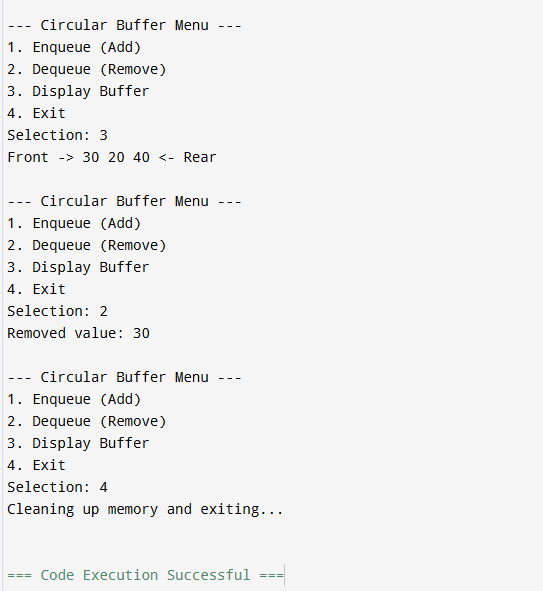
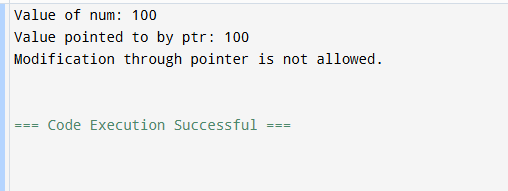
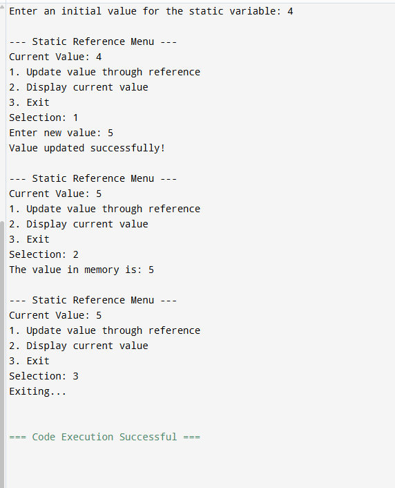

# 1. Write a C++ program to implement a singly linked list using struct for the node and dynamic memory allocation with new and delete. Implement the following operations:

# Insertion of a node at the beginning

# Insertion of a node at the end

# Deletion of a node

# Display the entire list
# Use new to allocate memory for each node, and delete to free memory when deleting nodes.

#include <iostream>

struct Node {
    int data;
    Node* next;
};

class LinkedList {
private:
    Node* head;

public:
    LinkedList() : head(nullptr) {}

    // Destructor to prevent memory leaks
    ~LinkedList() {
        Node* current = head;
        while (current != nullptr) {
            Node* nextNode = current->next;
            delete current;
            current = nextNode;
        }
    }

    void insertBeginning(int val) {
        Node* newNode = new Node{val, head};
        head = newNode;
        std::cout << "Added " << val << " to the start.\n";
    }

    void insertEnd(int val) {
        Node* newNode = new Node{val, nullptr};
        if (!head) {
            head = newNode;
        } else {
            Node* temp = head;
            while (temp->next) temp = temp->next;
            temp->next = newNode;
        }
        std::cout << "Added " << val << " to the end.\n";
    }

    void deleteValue(int val) {
        if (!head) return;

        if (head->data == val) {
            Node* temp = head;
            head = head->next;
            delete temp;
            std::cout << "Deleted " << val << ".\n";
            return;
        }

        Node* temp = head;
        while (temp->next && temp->next->data != val) {
            temp = temp->next;
        }

        if (temp->next) {
            Node* toDelete = temp->next;
            temp->next = temp->next->next;
            delete toDelete;
            std::cout << "Deleted " << val << ".\n";
        } else {
            std::cout << "Value " << val << " not found.\n";
        }
    }

    void display() {
        if (!head) {
            std::cout << "List is empty.\n";
            return;
        }
        Node* temp = head;
        std::cout << "Current List: ";
        while (temp) {
            std::cout << temp->data << " -> ";
            temp = temp->next;
        }
        std::cout << "NULL\n";
    }
};

int main() {
    LinkedList list;
    int choice, value;

    do {
        std::cout << "\n--- Linked List Menu ---\n";
        std::cout << "1. Insert at Beginning\n";
        std::cout << "2. Insert at End\n";
        std::cout << "3. Delete a Value\n";
        std::cout << "4. Display List\n";
        std::cout << "5. Exit\n";
        std::cout << "Enter choice: ";
        std::cin >> choice;

        switch (choice) {
            case 1:
                std::cout << "Enter value: ";
                std::cin >> value;
                list.insertBeginning(value);
                break;
            case 2:
                std::cout << "Enter value: ";
                std::cin >> value;
                list.insertEnd(value);
                break;
            case 3:
                std::cout << "Enter value to delete: ";
                std::cin >> value;
                list.deleteValue(value);
                break;
            case 4:
                list.display();
                break;
            case 5:
                std::cout << "Exiting program...\n";
                break;
            default:
                std::cout << "Invalid choice!\n";
        }
    } while (choice != 5);

    return 0;
}

  
# 2. Write a C++ program that dynamically allocates memory for an array of integers using new based on the size input by the user. The program should:

# Allow the user to enter the size of the array.

# Allow the user to enter the values for the array.

# Print the array.

# Free the dynamically allocated memory using delete[].

#include <iostream>

int main() {
    int size;

    // 1. Allow the user to enter the size of the array
    std::cout << "Enter the number of elements you want in the array: ";
    std::cin >> size;

    if (size <= 0) {
        std::cout << "Invalid size. Please enter a positive integer." << std::endl;
        return 1;
    }

    // 2. Dynamically allocate memory for the array
    // This memory is allocated on the Heap
    int* arr = new int[size];

    // 3. Allow the user to enter the values
    std::cout << "Enter " << size << " integers:" << std::endl;
    for (int i = 0; i < size; ++i) {
        std::cout << "Element " << i << ": ";
        std::cin >> arr[i];
    }

    // 4. Print the array
    std::cout << "\nYou entered the following array:" << std::endl;
    for (int i = 0; i < size; ++i) {
        std::cout << arr[i] << (i == size - 1 ? "" : ", ");
    }
    std::cout << std::endl;

    // 5. Free the dynamically allocated memory
    // Note the use of delete[] (with brackets) for arrays
    delete[] arr;
    
    // Set pointer to null to avoid "dangling pointer" issues
    arr = nullptr;

    std::cout << "\nMemory successfully freed." << std::endl;

    return 0;
}

# 3. Swap Two Numbers Using Pointers . Write a C++ program that swaps two numbers using pointers. The program should:

# Declare two integer variables.

# Use a pointer to swap their values.

# Print the swapped values.

#include <iostream>

// Function to swap values using pointers
void swap(int* ptr1, int* ptr2) {
    int temp = *ptr1; // Store the value pointed to by ptr1 in a temporary variable
    *ptr1 = *ptr2;    // Assign the value pointed to by ptr2 to the memory of ptr1
    *ptr2 = temp;     // Assign the temp value to the memory of ptr2
}

int main() {
    // 1. Declare two integer variables
    int a, b;

    std::cout << "Enter first number (a): ";
    std::cin >> a;
    std::cout << "Enter second number (b): ";
    std::cin >> b;

    std::cout << "\nBefore Swapping:" << std::endl;
    std::cout << "a = " << a << ", b = " << b << std::endl;

    // 2. Use pointers to swap their values
    // We pass the addresses of 'a' and 'b' using the address-of operator (&)
    swap(&a, &b);

    // 3. Print the swapped values
    std::cout << "\nAfter Swapping:" << std::endl;
    std::cout << "a = " << a << ", b = " << b << std::endl;

    return 0;
}

# 4. Write a C++ program that dynamically allocates memory for an array of strings (an array of pointers). The program should:

# Allow the user to input multiple strings.

# Print all the strings using the array of pointers.

# Free the allocated memory for each string and the array of pointers using delete[].

#include <iostream>
#include <string>

int main() {
    int count;

    // 1. Get the number of strings from the user
    std::cout << "How many strings do you want to enter? ";
    std::cin >> count;
    
    // Clear the input buffer so getline() doesn't skip the first input
    std::cin.ignore();

    // 2. Dynamically allocate an array of strings (array of pointers)
    // In C++, std::string objects manage their own internal char arrays,
    // but we are managing the collection of these objects dynamically.
    std::string* stringArray = new std::string[count];

    // 3. Allow user to input multiple strings
    std::cout << "\nEnter " << count << " strings:" << std::endl;
    for (int i = 0; i < count; ++i) {
        std::cout << "String [" << i + 1 << "]: ";
        std::getline(std::cin, stringArray[i]);
    }

    // 4. Print all the strings using the pointers
    std::cout << "\n--- Displaying Your Strings ---" << std::endl;
    for (int i = 0; i < count; ++i) {
        std::cout << "At index " << i << ": " << stringArray[i] << std::endl;
    }

    // 5. Free the allocated memory
    // Since we used new[], we MUST use delete[]
    delete[] stringArray;
    stringArray = nullptr;

    std::cout << "\nMemory for the array has been cleared." << std::endl;

    return 0;
}

# 5. Write a C++ program that implements a circular buffer using a dynamically allocated array. The program should:

# Dynamically allocate memory for the buffer.

# Allow the user to add and remove elements.

# Handle overflow and underflow conditions.

# Properly deallocate the memory used by the buffer.

#include <iostream>

class CircularBuffer {
private:
    int* buffer;
    int head;   // Write pointer
    int tail;   // Read pointer
    int size;   // Max capacity
    int count;  // Current elements

public:
    CircularBuffer(int s) : size(s), head(0), tail(0), count(0) {
        buffer = new int[size];
    }

    ~CircularBuffer() {
        delete[] buffer;
    }

    void enqueue(int value) {
        if (count == size) {
            std::cout << "Error: Buffer Overflow!\n";
            return;
        }
        buffer[head] = value;
        head = (head + 1) % size;
        count++;
        std::cout << "Successfully added " << value << ".\n";
    }

    void dequeue() {
        if (count == 0) {
            std::cout << "Error: Buffer Underflow!\n";
            return;
        }
        std::cout << "Removed value: " << buffer[tail] << "\n";
        tail = (tail + 1) % size;
        count--;
    }

    void display() {
        if (count == 0) {
            std::cout << "Buffer is currently empty.\n";
            return;
        }
        std::cout << "Front -> ";
        for (int i = 0; i < count; i++) {
            std::cout << buffer[(tail + i) % size] << " ";
        }
        std::cout << "<- Rear\n";
    }
};

int main() {
    int cap, choice, val;

    std::cout << "Enter the capacity of the circular buffer: ";
    std::cin >> cap;

    CircularBuffer cb(cap);

    do {
        std::cout << "\n--- Circular Buffer Menu ---\n";
        std::cout << "1. Enqueue (Add)\n";
        std::cout << "2. Dequeue (Remove)\n";
        std::cout << "3. Display Buffer\n";
        std::cout << "4. Exit\n";
        std::cout << "Selection: ";
        std::cin >> choice;

        switch (choice) {
            case 1:
                std::cout << "Enter value to add: ";
                std::cin >> val;
                cb.enqueue(val);
                break;
            case 2:
                cb.dequeue();
                break;
            case 3:
                cb.display();
                break;
            case 4:
                std::cout << "Cleaning up memory and exiting...\n";
                break;
            default:
                std::cout << "Invalid option. Try again.\n";
        }
    } while (choice != 4);

    return 0;
}

# 6. Write a C++ program that demonstrates the use of a pointer to a constant variable. The program should:

# Declare a constant variable and a pointer to it.

# Show how you can read the value pointed to by the pointer, but not modify it.

#include <iostream>
using namespace std;

int main() {
    // Declare a constant variable
    const int num = 100;

    // Declare a pointer to a constant integer
    const int* ptr = &num;

    // Reading the value using the pointer
    cout << "Value of num: " << num << endl;
    cout << "Value pointed to by ptr: " << *ptr << endl;

    // Attempting to modify the value through the pointer
    // *ptr = 200;   // ❌ ERROR: Cannot modify a constant value through pointer

    cout << "Modification through pointer is not allowed." << endl;

    return 0;
}

# 7. Write a C++ program where a function returns a reference to a local variable. What are  potential problems and how to avoid them. Implement a version where the function returns a reference to a static or globally declared variable.

#include <iostream>

// Function returns a reference to a static variable
int& accessStaticValue(int initialVal = 0, bool reset = false) {
    static int x = 10; // This variable lives for the duration of the program
    if (reset) {
        x = initialVal;
    }
    return x;
}

int main() {
    int choice, val;

    // 1. Let user define the starting value
    std::cout << "Enter an initial value for the static variable: ";
    std::cin >> val;
    accessStaticValue(val, true);

    do {
        std::cout << "\n--- Static Reference Menu ---\n";
        std::cout << "Current Value: " << accessStaticValue() << "\n";
        std::cout << "1. Update value through reference\n";
        std::cout << "2. Display current value\n";
        std::cout << "3. Exit\n";
        std::cout << "Selection: ";
        std::cin >> choice;

        switch (choice) {
            case 1: {
                // We capture the reference
                int& ref = accessStaticValue(); 
                std::cout << "Enter new value: ";
                std::cin >> val;
                
                // Modifying 'ref' modifies the static 'x' inside the function
                ref = val; 
                std::cout << "Value updated successfully!\n";
                break;
            }
            case 2:
                std::cout << "The value in memory is: " << accessStaticValue() << "\n";
                break;
            case 3:
                std::cout << "Exiting...\n";
                break;
            default:
                std::cout << "Invalid choice.\n";
        }
    } while (choice != 3);

    return 0;
}

